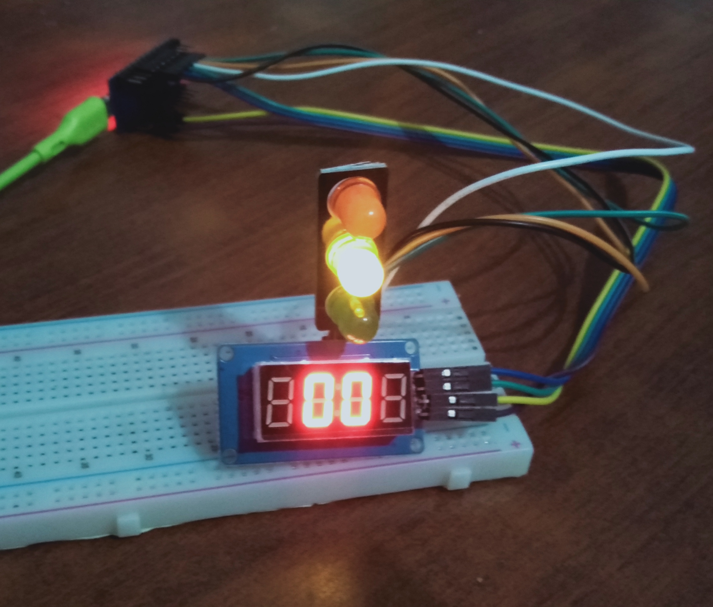
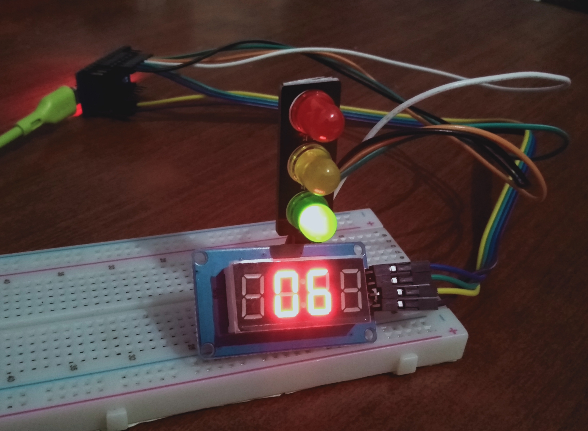

[](https://github.com/ellerbrock/open-source-badges/)
[](https://opensource.org/licenses/MIT)


# Arduino-Pro-Micro-based-Traffic-Light-Mini
<strong>Solo Project: Arduino Pro Micro-based Traffic Light Mini</strong><br><br>
Traffic lights are lights that control the flow of traffic. This project was created basically to show how the traffic light system works. Red indicates that the driver must stop, yellow indicates that the driver must prepare, and green indicates that the driver is allowed to walk. This project has been implemented and took approximately 1 day. The benefit of making this project is none other than to add insight. The results of this research show that the traffic light prototype can function properly.

<br><br>

## Project Requirements
| Part | Description |
| --- | --- |
| Development Board | Arduino Pro Micro Leonardo ATMEGA32U4 |
| Code Editor | Arduino IDE |
| Driver | CH340 USB Driver |
| Programming Language | C/C++ |
| Arduino Library | • Arduino (default)<br>• TM1637Display |
| Actuators | Traffic Light Module (x1) |
| Display | TM1637: 4 Digit 7 Segment Module (x1) |
| Other Components | • Micro USB cable - USB type A (x1)<br>• Jumper cable (1 set)<br>• Breadboard (x1)<br>• Adaptor DC 5V (x1) |

<br><br>

## Download & Install
1. Arduino IDE

   <table><tr><td width="810">
         
   ```
   https://bit.ly/ArduinoIDE_Installer
   ```

   </td></tr></table><br>
   
2. CH340 USB Driver

   <table><tr><td width="810">
   
   ```
   https://bit.ly/CH340_USB_Driver
   ```
   
   </td></tr></table>
   
<br><br>

## Project Designs
<table>
<tr>
<th width="420">Block Diagram</th>
<th width="420">Pictorial Diagram</th>
</tr>
<tr>
<td></td>
<td></td>
</tr>
</table>
<table>
<tr>
<th width="840">Wiring</th>
</tr>
<tr>
<td></td>
</tr>
</table>

<br><br>

## Arduino IDE Setup
1. Open the ``` Arduino IDE ``` first, then open the project by clicking ``` File ``` -> ``` Open ``` :

   <table><tr><td width="810">
   
      ``` Traffic_Light.ino ```

   </td></tr></table><br>
   
2. ``` Board Setup ``` in Arduino IDE

   <table>
      <tr><th width="810">

      How to setup the ``` Arduino Pro Micro ``` board
            
      </th></tr>
      <tr><td>
         
      Click ``` Tools ``` -> ``` Board ``` -> ``` Arduino AVR Boards ``` -> ``` Arduino Micro ```

      </td></tr>
   </table><br>
   
3. ``` Change the Board Speed ``` in Arduino IDE

   <table><tr><td width="810">
         
      Click ``` Tools ``` -> ``` Upload Speed ``` -> ``` 9600 ```

   </td></tr></table><br>
   
4. ``` Install Library ``` in Arduino IDE

   <table><tr><td width="810">
         
      Download all the library zip files. Then paste it in the: ``` C:\Users\Computer_Username\Documents\Arduino\libraries ```

   </td></tr></table><br>

5. ``` Port Setup ``` in Arduino IDE

   <table><tr><td width="810">
         
      Click ``` Port ``` -> Choose according to your device port ``` (you can see in device manager) ```

   </td></tr></table><br>

6. Before uploading the program please click: ``` Verify ```.<br><br>

7. If there is no error in the program code, then please click: ``` Upload ```.<br><br>

8. If there is still a problem when uploading the program, then try checking the ``` driver ``` / ``` port ``` / ``` others ``` section.

<br><br>

## Get Started
1. Download and extract this repository.<br><br>
   
2. Make sure you have the necessary electronic components.<br><br>
   
3. Make sure your components are designed according to the diagram.<br><br>
   
4. Configure your device according to the settings above.<br><br>

5. Please enjoy [Done].

<br><br>

## Highlights
<table>
<tr>
<th width="840" colspan="3">Mini Traffic Light Display</th>
</tr>
<tr>
<td width="280"></td>
<td width="280"></td>
<td width="280"></td>
</tr>
</table>

<br><br>

## Appreciation
If this work is useful to you, then support this work as a form of appreciation to the author by clicking the ``` ⭐Star ``` button at the top of the repository.

<br><br>

## Disclaimer
This application is my own work and is not the result of plagiarism from other people's research or work, except those related to third party services which include: libraries, frameworks, and so on.

<br><br>

## LICENSE
MIT License - Copyright © 2024 - Devan C. M. Wijaya, S.Kom

Permission is hereby granted without charge to any person obtaining a copy of this software and the software-related documentation files to deal in them without restriction, including without limitation the right to use, copy, modify, merge, publish, distribute, sublicense, and/or sell copies of the Software, and to permit persons receiving the Software to be furnished therewith on the following terms:

The above copyright notice and this permission notice must accompany all copies or substantial portions of the Software.

IN ANY EVENT, THE AUTHOR OR COPYRIGHT HOLDER HEREIN RETAINS FULL OWNERSHIP RIGHTS. THE SOFTWARE IS PROVIDED AS IS, WITHOUT WARRANTY OF ANY KIND, EITHER EXPRESS OR IMPLIED, THEREFORE IF ANY DAMAGE, LOSS, OR OTHERWISE ARISES FROM THE USE OR OTHER DEALINGS IN THE SOFTWARE, THE AUTHOR OR COPYRIGHT HOLDER SHALL NOT BE LIABLE, AS THE USE OF THE SOFTWARE IS NOT COMPELLED AT ALL, SO THE RISK IS YOUR OWN.
